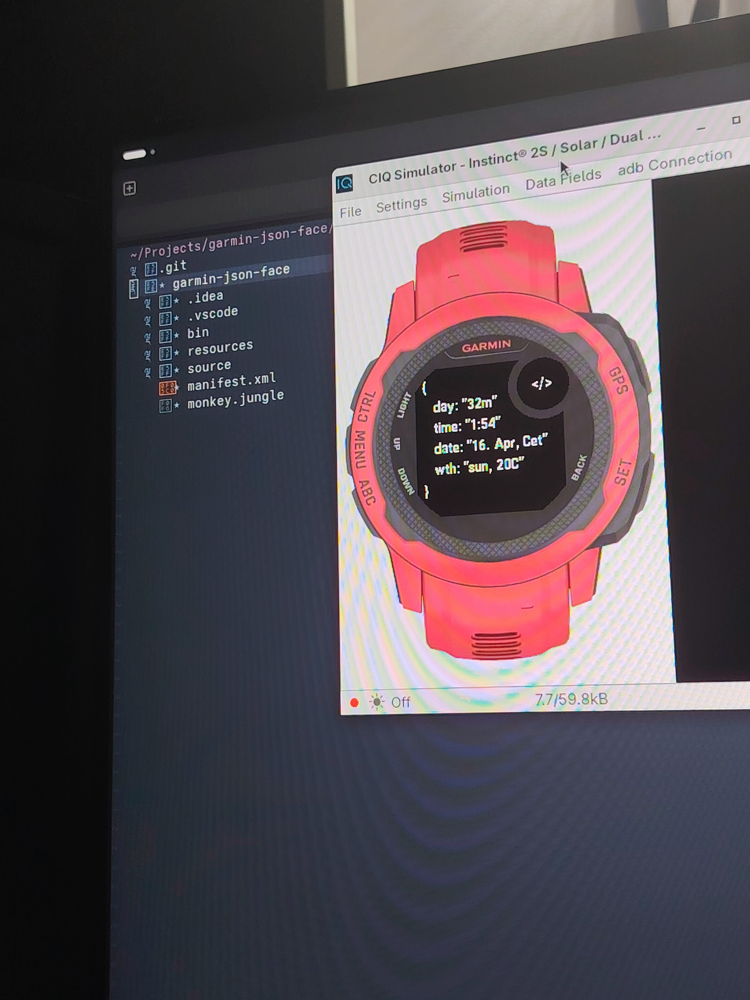
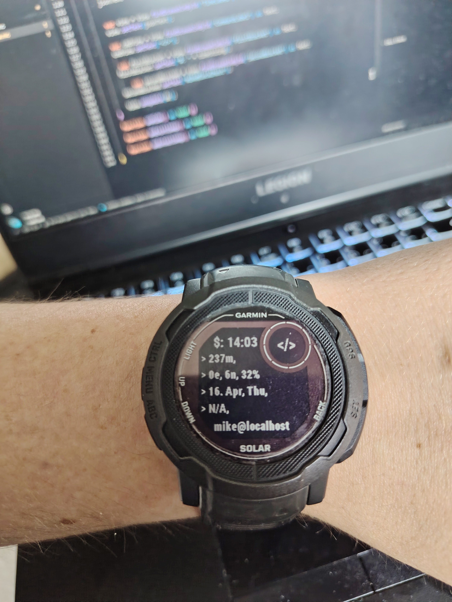

# { } Garmin JSON Face

**Status:** ⚠️ For fun / Unmaintained / Expect bugs

## 💡 The Idea
The original goal was to build a nerdy, developer-centric watch face that renders time, weather, and other device metrics as a raw JSON object right on the wrist. 

## 📉 The Reality (Why it's stripped down)
This was initially built and tested for the **Garmin Instinct 2**. However, the Instinct 2's screen resolution and monochrome memory-in-pixel (MIP) display proved to be far from ideal for rendering dense, bracketed text. 

Because reading tiny JSON strings on a rugged watch is a great way to strain your eyes, the current iteration is heavily stripped down. It abandons the "full payload" idea and only shows basic, essential information wrapped in a minimal JSON-like aesthetic.